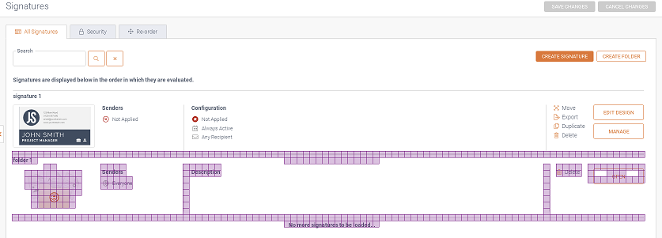
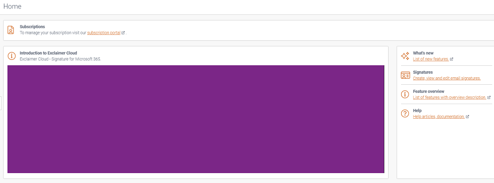

# Automated Visual Testing with Visual Driver

## About this Project

Lots of tests rely on WebDriver and similar tools to automate end to end testing. While this ensures elements are displayed 'somewhere' on a page, they do not guarantee that elements are exactly where they should be and looking exactly as expected.

Using this 'visual' approach tests can execute a lot quicker and ensure elements are rendered how we expect them to be rather than the typical approach of trying to find each element to ensure things have loaded on to a page.

## How it works

Once a particular page or area of your website is complete, tests can be written using Visual Driver to capture the expected appearance and layout. This is done by capturing a set of baseline image for each area or section to be checked.

The first time you run your tests the baseline images will not exist, Visual Driver will capture these for you and store them. On subsequent runs these are then compared with the live rendering of your page (i.e. what is actually displayed in the browser) and any differences are recorded and highlighted via an automatically generated comparison image.

For example, in the below image an additional item has been added which did not exist in the baseline image and this has been drawn out using a partial overlay made up of purple coloured cells.



## Basic Usage

Visual comparison results are generated by simply calling `CheckWindow` once the test has navigated to the desired area of your site, as in the following example:

```csharp
[TestMethod]
public void Visual_Comparison_Test()
{
    // Arrange
    Driver.Navigate().GoToUrl("www.google.com");

    // Act
    var result = await _visualDriver.CheckWindowAsync("Tag");

    // Assert
    Assert.IsTrue(result.Match);
}
```

If any differences are identified during the comparison, a new image is generated with all the differences drawn on top of the baseline image. This is then added to the result object returned by `CheckWindow`. It is also saved to local test output under a folder named `ComparisonResults` .

When calling `CheckWindow` a unique tag should be used to correctly associate the generated baseline image with the page being checked. For example `CheckWindow("Homepage")` for a test which checks your homepage, and `CheckWindow("Help Page")` for your help page, and so on.

## Handling Dynamic Page Content

Page areas with dynamic or rotating content can present issues as they increase the likelihood of a false mismatch when compared to the baseline.

This can be dealt with by supplying selector(s) of the page elements which contain the dynamic content to be ignored. These areas can then be used to define regions within the page which will be automatically ignored during visual comparison.

Ignore regions can be specified in the following way:

```csharp
[TestMethod]
public void Visual_Comparison_Test_With_Dynamic_Content()
{
    ComparisonOptions options = new ComparisonOptions();
    options.IgnoreRegions = new[] { By.CssSelector(".my-dynamic-element-class") };

    var result = await _visualDriver.CheckWindowAsync(tag, options);

    Assert.IsTrue(result.Match, "Found unexpected visual mismatch during image comparison");
}
```

Following these steps, a solid rectangle will be drawn on top of the specified ignore region.

In the following example, an ignore region has been used to block-out a dynamic video:



Ignore regions can also be defined globally for cases where a dynamic element is repeated on every page or section of your site:

```csharp
public void Test_Setup()
{
    By[] GlobalIgnoreRegions = { By.CssSelector(".my-global-ignore-region-selector") };
    visualDriver.AddGlobalIgnoreRegions(GlobalIgnoreRegions);
}
```

## Setup

Visual Driver has only the one mandatory configuration parameter (`ImageStorageConnectionString`). This should be a connection string to a valid Azure Storage account and is used to store and retrieve baseline images during run time.

The full set of supported appsettings are provided below.

```json
{
  "VisualSettings": {
    "ImageStorageConnectionString": "your connection string here",
    "UpdateBaseline": false,
    "WaitBeforeImageComparison": "0:00:05"
  }
}
```

`UpdateBaseline` can be used to force Visual Driver to update your baseline images whenever you have made a known change to your app. This should only be used once the changes have all been manually verified for correctness. Only baseline images that have differences detected will be updated. This defaults to false unless specified.

`WaitBeforeImageComparison` can be used to define the maximum period of time Visual Driver should wait for the baseline to match the currently rendered page. This can be increased in cases where the page is slow to fully load or settle. This defaults to 5 seconds unless specified.

## Limitations

For consistent results, visual tests should be run with the following constraints:

- The browser should be run in headless mode.
- The browser window size (set via WebDriver) should be consistent across test runs. An exception will be thrown if the current window size does not match that of the baseline image during comparison.
- The execution environment of the tests should also be consistent. For example, running under Windows will produce subtle rendering differences compared to running under Linux.
